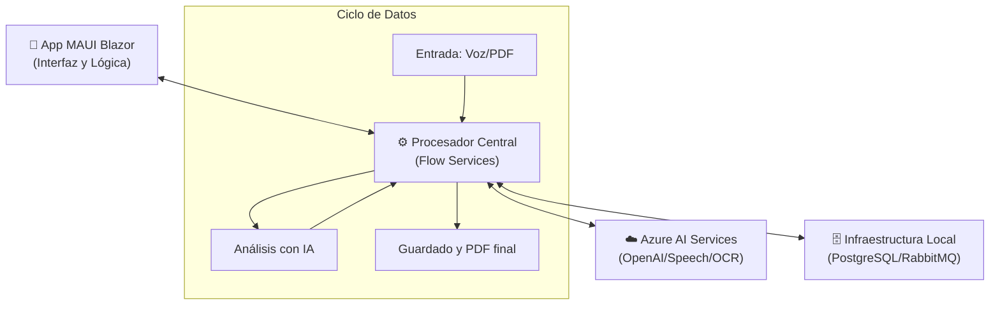

# 📄 Documento Explicativo - FacturApp

## 🏗️ 1. Arquitectura General del Sistema

FacturApp utiliza una arquitectura hibrida que combina el poder de **.NET MAUI** para el acceso nativo al dispositivo y **Blazor** para una interfaz de usuario flexible. El sistema está diseñado para ser reactivo, utilizando colas de mensajes y servicios de IA en la nube.

### 🧩 Resumen de Componentes (Vista Rápida)

Si el diagrama inferior no se visualiza correctamente, consulta esta tabla resumen:

| Capa | Tecnologías | Responsabilidad |
| :--- | :--- | :--- |
| **Presentación** | Blazor Hybrid, HTML5, CSS3 | Interfaz de usuario y captura de voz/archivos. |
| **Lógica** | C# (.NET 8), ViewModels | Orquestación de servicios y lógica de negocio. |
| **IA (Nube)** | Azure OpenAI, Speech, Doc Intelligence | Procesamiento inteligente y comprensión de lenguaje. |
| **Infraestructura** | PostgreSQL, pgvector, RabbitMQ | Almacenamiento, búsqueda vectorial y colas asíncronas. |

### 📊 Diagrama de Flujo y Estructura

### 🛰️ Detalle de Funcionamiento

#### **1. El Frontend (Blazor Hybrid)**
La aplicación corre sobre el motor nativo del dispositivo pero renderiza una interfaz web moderna. Esto permite que el botón de grabación acceda directamente al micrófono y que el selector de archivos lea PDFs del almacenamiento local de forma segura.

#### **2. El Cerebro (Azure AI Ecosystem)**
Toda la inteligencia está delegada en Azure para garantizar velocidad y precisión:
- **Traducción de voz:** Convierte tus comandos en texto procesable.
- **Comprensión:** GPT-4o entiende qué quieres hacer (ej. "Crea una factura para David").
- **Extracción:** Document Intelligence lee los datos de tus PDFs sin que tengas que escribirlos.

#### **3. Motor de Fondo (Infraestructura)**
- **RabbitMQ:** Funciona como un "mayordomo" que recibe las tareas pesadas de procesamiento de documentos para que la pantalla del usuario nunca se congele.
- **pgvector:** Permite que la aplicación no solo busque por nombre, sino por "conceptos", analizando el contenido de las facturas de forma inteligente.

---
---

## 2. Servicios de Azure Utilizados

| Servicio | Propósito en el Proyecto |
| :--- | :--- |
| **Azure OpenAI (GPT-4o)** | Cerebro del asistente. Procesa lenguaje natural, genera respuestas inteligentes y orquestra la lógica de creación de facturas. |
| **Azure Document Intelligence** | Analizador inteligente de documentos. Se utiliza el modelo `prebuilt-invoice` para extraer automáticamente proveedores, totales y líneas de factura. |
| **Azure AI Speech** | Permite la interacción manos libres. Convierte la voz del usuario en texto (STT) y las respuestas del sistema en audio (TTS). |

---

## 3. Componentes Clave

- **RabbitMQ:** Gestiona la comunicación asíncrona para que la UI nunca se bloquee mientras se procesan documentos pesados o se consulta a la IA.
- **PostgreSQL + pgvector:** No solo almacena facturas, sino que está preparado para realizar búsquedas basadas en el significado (búsqueda vectorial).
- **QuestPDF:** Generación dinámica de facturas profesionales en formato PDF.

---

## 4. Capturas de Pantalla (Sugeridas)

> [!NOTE]
> Para completar este documento como PDF, se recomienda incluir capturas de las siguientes secciones:

1. **Dashboard Principal:** Vista de la lista de facturas generadas.
2. **Asistente IA:** Interfaz de chat interactivo con el asistente de voz activo.
3. **Procesamiento de Documentos:** Pantalla de subida de archivos y visualización de datos extraídos.
4. **RabbitMQ Management:** Captura del panel `http://localhost:15672` mostrando los mensajes en cola.

---

## 5. Instrucciones de Configuración Rápida

1. **Levantar Docker:** `docker-compose up -d`
2. **Configurar Claves:** Editar `Config/AppConfig.cs` con tus credenciales de Azure.
3. **Ejecutar:** F5 en Visual Studio o `dotnet run`.

---
*Documento generado para el proyecto FacturApp - David Paredes.*
